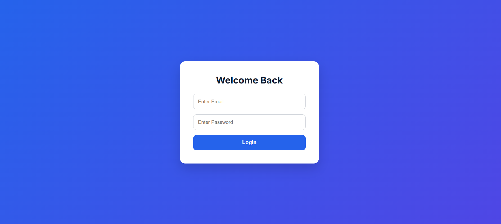
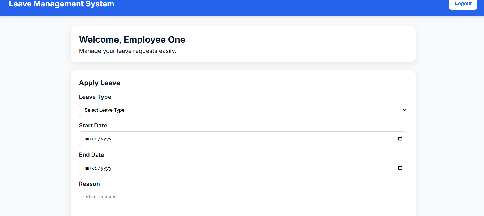
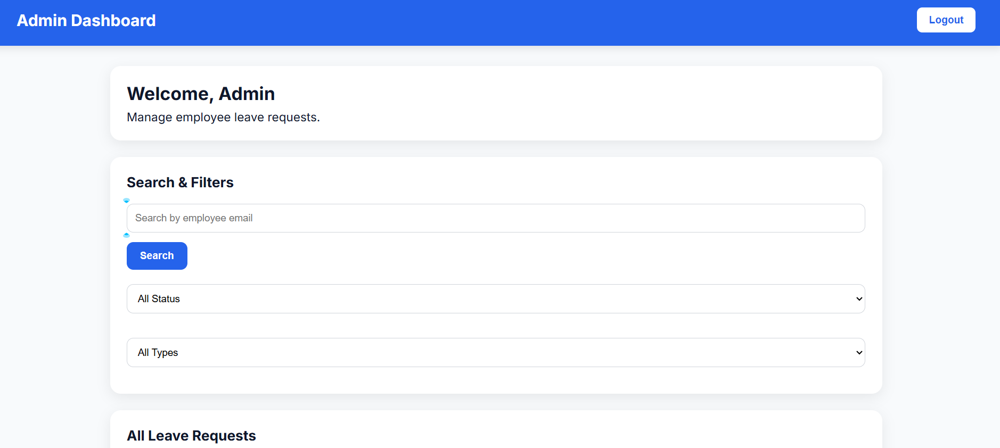

# Leave Management System

A simple Leave Management System built using HTML, CSS, JavaScript, and Supabase.

The project demonstrates authentication, role-based access control, Row Level Security (RLS), leave request management, and an admin dashboard for managing employee leave requests.

---

## Features

### Authentication

- User Signup
- User Login
- User Logout
- Supabase Authentication

### Employee Features

- Apply Leave Request
- View Own Leave Requests
- Cancel Pending Leave Requests

### Admin Features

- View All Leave Requests
- Approve Leave Requests
- Reject Leave Requests
- Delete Leave Requests
- Search Employees by Email
- Filter Leave Requests by Status
- Filter Leave Requests by Leave Type

### Security Features

- Route Protection
- Role-Based Access Control
- Supabase Row Level Security (RLS)

### UI Features

- Responsive Design
- Modern Dashboard UI
- Toast Notifications
- Confirmation Modal
- Status Badges

---

## Tech Stack

### Frontend

- HTML5
- CSS3
- JavaScript (ES6)

### Backend & Database

- Supabase
- PostgreSQL

### Authentication

- Supabase Auth

---

## Project Structure

```text
leave-management-system/

css/
├── admin.css
├── auth.css
├── components.css
└── dashboard.css

js/
├── admin.js
├── auth.js
├── dashboard.js
├── leave.js
├── supabase.js
└── ui.js

database/
├── leave_management_profiles.sql
├── leave_management_requests.sql
└── rls-policies.sql

screenshots/

admin.html
dashboard.html
login.html

config.example.js
README.md
```

---

## Row Level Security (RLS)

RLS is enabled on:

```text
leave_management_requests
```

### Employee Policies

- Users can insert their own leave requests
- Users can view their own leave requests
- Users can delete their own pending leave requests

### Admin Policies

- Admins can view all leave requests
- Admins can update leave requests
- Admins can delete leave requests

---

## Installation

### 1. Clone Repository

```bash
git clone https://github.com/YOUR_USERNAME/leave-management-system.git
```

### 2. Create Supabase Project

Create a new project in Supabase.

### 3. Create Database Tables

Run:

```text
database/leave_management_profiles.sql
```

Run:

```text
database/leave_management_requests.sql
```

### 4. Configure RLS

Run:

```text
database/rls-policies.sql
```

### 5. Configure Environment

Copy:

```text
config.example.js
```

Create:

```text
config.js
```

Add your Supabase credentials:

```javascript
const CONFIG = {
  SUPABASE_URL: "YOUR_SUPABASE_URL",
  SUPABASE_ANON_KEY: "YOUR_SUPABASE_ANON_KEY"
};
```

### 6. Run Project

Open:

```text
login.html
```

using Live Server or any local development server.

---

## Screenshots

### Login Page



### Employee Dashboard



### Admin Dashboard

